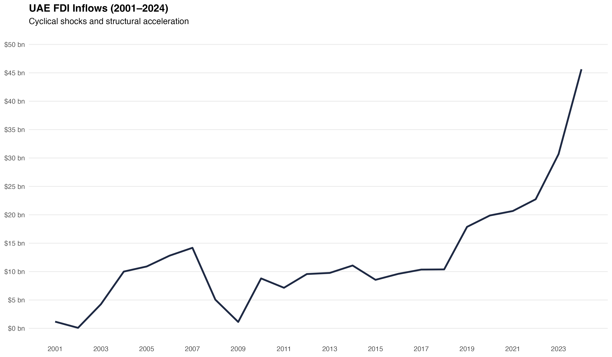

# Assessing the Resilience & Policy Controllability of UAE FDI (2025–2026)

## Executive Overview

Foreign Direct Investment (FDI) plays a central role in the UAE’s economic diversification and long-term growth strategy. While recent years have demonstrated strong investment momentum, short-term FDI inflows remain sensitive to global financing conditions, regional oil price dynamics, and shifts in investor confidence.

Over the past 2 years, global monetary tightening has affected the cost of capital and the availability of cross-border financing. In the UAE, domestic financial conditions have tightened in line with global rates, with the Central Bank's policy rate increasing alongside the US Federal Reserve. At the same time, movements in oil prices continue to shape regional liquidity and investor sentiment, showing how external macroeconomic conditions influence investment timing.

In this context, understanding the resilience of UAE FDI momentum has become essential. This analysis therefore examines UAE FDI inflows over the 2025–2026 forecast horizon using a scenario-based framework. Rather than solely focusing on forecast accuracy, the objective is to assess how resilient recent investment momentum is under different global conditions, identify the key drivers of short-term volatility, and evaluate which factors are most relevant for stabilizing or supporting outcomes over the next 2 years.

---

## Evolution of UAE FDI Inflows 

Before assessing forward-looking resilience, it is important to understand how UAE FDI has behaved across prior global cycles. Between 2001 and 2024, UAE foreign direct investment (FDI) inflows exhibited clear cyclical responses to global shocks alongside distinct phases of structural acceleration.

The chart highlights three distinct regimes in UAE FDI inflows.

The early-2000s expansion in FDI aligned with the UAE’s emergence as a regional trade and logistics hub, supporting increased project finance and cross-border investment.

The global financial crisis of 2008–09 sharply reduced inflows from USD 14.1 billion in 2007 to USD 1.1 billion in 2009. Unlike many emerging markets, UAE FDI rebounded within a few years rather than entering prolonged stagnation. Following this recovery, inflows stabilized within a mid-range band before rising sharply to nearly USD 17.9 billion by 2019, reflecting increased greenfield project activity and further expansion across logistics, free zones, and service-related sectors.

The COVID period diverged from conventional crisis dynamics: instead of contracting, FDI remained elevated through 2020–2022. This resilience stands in contrast to global FDI flows over the same period, which generally weakened. The post-pandemic phase represents a structural acceleration rather than a simple cyclical rebound. In 2023, inflows jumped to approximately USD 30.7 billion, placing the UAE among the most dynamic global FDI destinations and second only to the United States in greenfield project announcements. In 2024, this acceleration culminated in a record USD 45.6 billion in net FDI, elevating the UAE into the top-10 global destination ranking and accounting for a dominant share of total inflows into the Middle East.

The magnitude and consistency of recent inflows across greenfield projects, reinvestments, and diversified sector activity suggest that 2023–2024 represent more than a typical cyclical upswing; they mark a distinct upward shift in UAE investment flows. This structural acceleration raises an important policy question: how durable is this momentum under tightening global conditions?

---

## Policy Question & Decision Context

From a policy and strategy perspective, the central issue is not whether FDI will be marginally higher or lower in a given year. The more relevant questions are:

- How exposed are UAE FDI inflows to external shocks over the next 1-2 years?
- Which macroeconomic channels most strongly influence investor behaviour in the short term?
- What range of outcomes should decision-makers reasonably plan for under different global scenarios?

These questions are particularly relevant in an environment where capital remains selective, post-COVID investment pipelines are still normalising, and competition for mobile international investment remains intense.

---

## What This Analysis Is (and Is Not)

### What This Analysis Is
- A short-term assessment of UAE FDI resilience for the forecast period of 2025–2026  
- A scenario-based framework for evaluating upside and downside risks under alternative global conditions  
- An empirical analysis of short-run macroeconomic channels affecting FDI inflows  
- A policy-oriented interpretation grounded in observed economic relationships  

### What This Analysis Is Not
- A long-run structural growth or development model  
- A precise point prediction of future FDI inflows  
- A cross-country benchmarking or panel-data exercise  
- An academic exercise focused on econometric optimization  

---

## Analytical Framework & Model

This analysis uses a short-run time-series framework to evaluate how UAE FDI inflows respond to changes in key macroeconomic and financial conditions over the short term.

The core empirical tool is an Autoregressive Distributed Lag (ARDL) model estimated on annual UAE data from 2001 to 2024. The ARDL specification is well suited to the dataset, as it accommodates variables with mixed integration orders and captures short-run dynamics without requiring pre-differencing.


However, ARDL-based forecasts can overreact to short-term fluctuations. To address this, base-case projections are blended with a trend anchor derived from recent realized FDI growth. This ensures that forecasts remain grounded in observed investment momentum while preserving sensitivity to underlying macroeconomic conditions.

The ARDL model's role is to:

- Quantify the short-run exposure of FDI inflows to movements in oil prices, economic growth, and trade openness  
- Capture delayed responses and persistence effects that are common in investment data  
- Provide a baseline trajectory around which alternative scenarios can be constructed  

### Data & Estimation Window

The estimation sample covers the period from 2001 to 2024, reflecting the availability and consistency of key macroeconomic series for the UAE. Variables are selected to balance economic relevance with data reliability and include:

- FDI net inflows (current US dollars)  
- Brent crude oil prices (annual average)  
- Real GDP growth  
- Trade Openness (trade as a percentage of GDP)  

Given the short annual sample and the presence of mixed integration orders, the analysis focuses on robust short-run inference rather than formal long-run cointegration relationships.

### Model Diagnostics & Stability

A comprehensive diagnostic framework is applied to ensure statistical reliability and structural stability of the ARDL specification.

The model is tested for serial correlation, heteroskedasticity, residual normality, parameter stability, and potential long-run cointegration. Where serial correlation is detected, inference is conducted using heteroskedasticity- and autocorrelation-consistent (Newey–West HAC) standard errors.

Results indicate:

- No evidence of heteroskedasticity  
- Approximately normal residuals  
- Stable parameters over the estimation window  
- No evidence of long-run cointegration  

Accordingly, the model is treated explicitly as a short-run dynamic framework suitable for conditional scenario-based forecasting.

A detailed technical exposition of model specification, diagnostics, and forecast construction is provided in the ["Methodology & Model Framework"](methodology/Methodology.md).

---

## Model-Implied FDI Dynamics

The estimated ARDL framework indicates that UAE FDI dynamics are primarily driven by investment momentum and oil-linked liquidity effects, with domestic growth playing a secondary role.

FDI exhibits strong persistence: last-year inflows affect next-year outcomes. This reflects the role of project pipelines, reinvestment decisions, and implementation lags in large-scale investments. Once momentum builds, it tends to carry into the following year before gradually dissipating.

Oil prices influence FDI in stages rather than instantaneously. Initial oil shocks generate caution and uncertainty, but are later followed by improved liquidity and investor confidence that support capital deployment. This pattern indicates that FDI movements are closely linked to regional liquidity cycles.

GDP growth is positively associated with FDI but plays a secondary role. Trade Openness does not materially influence year-to-year fluctuations, suggesting it operates more as a structural determinant than a cyclical driver.

These channels provide the foundation for interpreting the scenario results that follow.

---

## Scenario Analysis (2025–2026)

### Scenario Framework & Assumptions

Rather than relying on a single forecast path, this analysis evaluates UAE FDI outcomes under a small set of macroeconomic scenarios. Each scenario reflects a plausible combination of global financial conditions, energy market dynamics, and regional growth expectations over the 2025–2026 horizon.

The scenarios are not intended as predictions. They are designed to bound reasonable outcomes and to assess how sensitive short-term FDI inflows are to changes in the external environment.

#### Base Case: Gradual Normalisation

The base case reflects a continuation of recent trends, with global financial conditions easing gradually but remaining tighter than the pre-2022 period. Energy prices stabilize near recent averages, and UAE growth remains solid but not accelerating.

Key assumptions:
- Brent crude reflects the observed January 2025 levels, with prices moderating toward the USD 70–75 range in 2026, consistent with major energy market outlooks (EIA/IEA).
- UAE real GDP growth remains close to 5%, reflecting projections from the IMF World Economic Outlook.
- Trade openness remains broadly stable, with no major structural shift  

Under this scenario, FDI inflows are expected to remain resilient, supported by existing investment momentum and a stable macroeconomic backdrop.

#### Downside Case: Prolonged External Tightness

The downside scenario reflects a more challenging global environment, where tighter financial conditions persist. Softer energy prices reduce regional liquidity, and international investors become more selective in committing capital.

Key assumptions:
- Brent crude declines toward the USD 60–65 range  
- Global financing conditions remain restrictive 
- UAE growth moderates but remains positive  

Under this scenario, FDI inflows are expected to undershoot recent momentum, driven primarily by delayed investment decisions.

#### Upside Case: Liquidity and Confidence Rebound

The upside scenario reflects a faster-than-expected improvement in global financial conditions, alongside stronger energy prices and improved investor confidence.

Key assumptions:
- Brent crude moves toward the USD 85–90 range  
- Global financial conditions ease more rapidly than anticipated  
- UAE growth remains robust, supported by strong domestic demand and external inflows  

Under this scenario, FDI inflows exceed baseline momentum due to improved risk sentiment and accelerated capital deployment.

### ARDL Scenario Results

Using the estimated ARDL framework and the macroeconomic assumptions outlined above, conditional projections for UAE FDI inflows are generated for 2025 and 2026 under each scenario.

The results below reflect **pure ARDL projections**, prior to any anchor adjustment or blending.

| Scenario   | FDI 2025 (USD bn) | FDI 2026 (USD bn) |
|------------|-------------------|-------------------|
| Base       | 42.8              | 30.8              |
| Downside   | 36.9              | 33.2              |
| Upside     | 46.9              | 31.3              |

Key takeaways from the ARDL scenarios:

- The **Upside** case raises the 2025 2025 inflows relative to the Base scenario, consistent with stronger oil-linked liquidity and investor confidence.
- The **Downside** case lowers 2025 inflows, reflecting tighter global conditions and softer energy prices.
- Across scenarios, **2026 outcomes converge**, suggesting partial normalization after the initial scenario impact.
- Differences across scenarios are most pronounced in **2025**, when oil dynamics and persistence effects are strongest.

These ARDL scenario results provide the stress-test range. The next sections introduce a trend anchor to raccount for recent structural momentum and assess how conclusions change when forecasts are anchored to post-pandemic inflow dynamics. 

---

## Trend Anchor & Momentum Adjustment

While the ARDL framework provides a disciplined estimate based on historical transmission dynamics, recent FDI outcomes suggest a possible structural acceleration beyond what historical averages alone would imply.

The 2023 and 2024 inflows represent a marked break from the prior decade’s range, both in magnitude and consistency. This raises an important question: should projections rely solely on mean-reverting historical relationships, or should recent momentum be partially incorporated into the forward-looking baseline?

To address this, a structural trend anchor is introduced for the Base scenario.

The anchor is constructed using a weighted geometric average of recent FDI growth, placing greater emphasis on post-pandemic years. This approach captures the possibility that recent inflows reflect more than a temporary liquidity cycle and may signal a higher structural investment trajectory.

The anchor does not replace the ARDL framework. Instead, it serves as a complementary reference path against which model-implied normalization can be evaluated.

---

## Why This Matters for the UAE (2025–2026)

The 2025–2026 period is particularly relevant given ongoing uncertainty around global financing conditions, the continued influence of oil prices on regional liquidity, and heightened competition among investment destinations.

At the same time, the UAE enters this period with strong structural fundamentals, established investment platforms, and a track record of attracting and retaining foreign capital. Distinguishing between temporary external pressures and more persistent drivers of FDI is therefore critical for avoiding overreaction to short-term shocks, prioritising effective interventions, and maintaining a credible investment narrative.

By framing FDI outcomes as a range of plausible scenarios rather than a single forecast, this analysis aims to support more robust and risk-aware economic decision-making.
