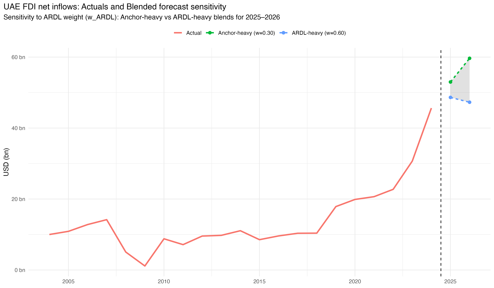

# Assessing the Resilience & Policy Controllability of UAE FDI (2025–2026)

## Executive Overview

Foreign Direct Investment (FDI) plays a central role in the UAE’s economic diversification and long-term growth strategy. While recent years have demonstrated strong investment momentum, short-term FDI inflows remain sensitive to global financing conditions, regional oil price movements, and shifts in investor confidence.

Over the past 2 years, global monetary tightening has affected the cost of capital and the availability of cross-border financing. In the UAE, domestic financial conditions have tightened in line with global rates, with the Central Bank's policy rate increasing alongside the US Federal Reserve. At the same time, movements in oil prices continue to shape regional liquidity and investor sentiment, highlighting how external macroeconomic conditions influence investment timing.

In this context, understanding the resilience of UAE FDI momentum has become essential. This analysis therefore examines UAE FDI inflows over the 2025–2026 forecast horizon using a scenario-based framework. Rather than solely focusing on forecast accuracy, the objective is to assess how resilient recent investment momentum is under different global conditions, identify the key drivers of short-term volatility, and evaluate which factors are most relevant for stabilizing or supporting outcomes over the next 2 years.

---

## Evolution of UAE FDI Inflows 

To assess forward-looking resilience, it is first necessary to examine how UAE FDI has behaved across past global cycles. Between 2001 and 2024, UAE foreign direct investment (FDI) inflows exhibited clear cyclical responses to global shocks alongside distinct phases of structural acceleration.

The chart highlights three distinct regimes in UAE FDI inflows.

The early-2000s expansion in FDI aligned with the UAE’s emergence as a regional trade and logistics hub, supporting increased project finance and cross-border investment.

The global financial crisis of 2008–09 sharply reduced inflows from USD 14.1 billion in 2007 to USD 1.1 billion in 2009. Unlike many emerging markets, UAE FDI rebounded within a few years rather than entering prolonged stagnation. After stabilizing in the post-crisis period, inflows accelerated to nearly USD 17.9 billion by 2019, driven by increased greenfield project activity and further expansion across logistics, free zones, and service-related sectors.

The COVID period diverged from conventional crisis patterns: instead of contracting, FDI remained elevated through 2020–2022. This resilience stands in contrast to broader global trends, where FDI flows generally weakened. The post-pandemic phase represents a structural step-up rather than a simple cyclical rebound. In 2023, inflows jumped to approximately USD 30.7 billion, placing the UAE among the leading global FDI destinations and second only to the United States in greenfield project announcements. In 2024, inflows reached a record USD 45.6 billion, placing the UAE among the top 10 global destinations and accounting for a dominant share of total inflows into the Middle East.

The magnitude and consistency of recent inflows across greenfield projects, reinvestments, and diversified sector activity suggest that 2023–2024 represent more than a typical cyclical upswing; they mark a distinct upward shift in UAE investment flows. This structural acceleration raises an important policy question: how durable is this momentum under tightening global conditions?

---

## Policy Question & Decision Context

From a policy perspective, the key issue is not whether FDI will be marginally higher or lower in a given year. The more relevant questions are:

- How exposed are UAE FDI inflows to external shocks over the next 1-2 years?
- Which macroeconomic variables most strongly influence investor behaviour in the short term?
- What range of outcomes should decision-makers reasonably plan for under different global scenarios?

These questions are particularly relevant in an environment where capital remains selective, post-COVID investment pipelines are still adjusting, and competition for international investment remains intense. To address these questions clearly, it is important to define the scope and limits of the analysis.

---

## What This Analysis Is (and Is Not)

### What This Analysis Is
- A short-term assessment of UAE FDI resilience for the forecast period of 2025–2026  
- A scenario-based framework for evaluating upside and downside risks under alternative global conditions  
- An empirical analysis of short-run macroeconomic channels affecting FDI inflows  
- A policy-oriented interpretation grounded in observed economic relationships  

### What This Analysis Is Not
- A long-run structural growth or development model  
- A precise point prediction of future FDI inflows  
- A cross-country benchmarking or panel-data exercise  
- An academic exercise focused on econometric optimization  

---

## Analytical Framework & Model

This analysis uses a short-run time-series framework to evaluate how UAE FDI inflows respond to changes in key macroeconomic and financial conditions over the short term.

The core empirical tool is an Autoregressive Distributed Lag (ARDL) model estimated on annual UAE data from 2001 to 2024. The ARDL specification is well suited to the dataset, as it accommodates variables with mixed integration orders and captures short-run dynamics without requiring pre-differencing.


However, ARDL-based forecasts can overreact to short-term fluctuations. To address this, base-case forecasts are blended with a trend anchor derived from recent realized FDI growth. This ensures that forecasts remain grounded in observed investment momentum while preserving sensitivity to underlying macroeconomic conditions.

The ARDL model's role is to:

- Quantify the short-run exposure of FDI inflows to movements in oil prices, economic growth, and trade openness  
- Capture delayed responses and persistence effects that are common in investment data  
- Provide a baseline trajectory around which alternative scenarios can be constructed  

### Data & Estimation Window

The estimation sample covers the period from 2001 to 2024, reflecting the availability and consistency of key macroeconomic series for the UAE. Variables are selected to balance economic relevance with data reliability and include:

- FDI net inflows (current US dollars)  
- Brent crude oil prices (annual average)  
- Real GDP growth  
- Trade Openness (trade as a percentage of GDP)  

Given the short annual sample and the presence of mixed integration orders, the analysis focuses on robust short-run inference rather than formal long-run cointegration relationships.

### Model Diagnostics & Stability

A comprehensive diagnostic framework is applied to ensure statistical reliability and structural stability of the ARDL specification.

The model is tested for serial correlation, heteroskedasticity, residual normality, parameter stability, and potential long-run cointegration. Where serial correlation is detected, inference is conducted using heteroskedasticity- and autocorrelation-consistent (Newey–West HAC) standard errors.

Results indicate:

- No evidence of heteroskedasticity  
- Approximately normal residuals  
- Stable parameters over the estimation window  
- No evidence of long-run cointegration  

Accordingly, the model is treated explicitly as a short-run dynamic framework suitable for conditional scenario-based forecasting.

A detailed technical exposition of model specification, diagnostics, and forecast construction is provided in the ["Methodology & Model Framework"](methodology/Methodology.md).

---

## Model-Implied FDI Dynamics

The ARDL estimates indicate that UAE FDI is primarily driven by investment momentum and oil-linked liquidity, with domestic growth playing a secondary role.

FDI exhibits strong persistence: last-year inflows affect next-year outcomes. This reflects the role of project pipelines, reinvestment decisions, and implementation lags in large-scale investments. Once momentum builds, it tends to carry into the following year before gradually dissipating.

Oil prices influence FDI in stages rather than instantaneously. Initial oil shocks generate caution and uncertainty, but as liquidity improves and confidence returns, inflows recover. This means UAE FDI moves closely with regional liquidity conditions.

GDP growth supports FDI but plays a secondary role. Trade openness does not materially influence year-to-year fluctuations, operating more as a structural backdrop than a cyclical driver.

These channels provide the foundation for interpreting the scenario results that follow.

---

## Scenario Analysis (2025–2026)

### Scenario Framework & Assumptions

Rather than relying on a single forecast path, this analysis evaluates UAE FDI outcomes under a small set of macroeconomic scenarios. Each scenario reflects a plausible combination of global financial conditions, energy market dynamics, and regional growth expectations over the 2025–2026 horizon.

The scenarios are not intended as predictions. They are designed to bound reasonable outcomes and to assess how sensitive short-term FDI inflows are to changes in the external environment.

#### Base Case: Gradual Normalization

The base case reflects a continuation of recent trends, with global financial conditions easing gradually but remaining tighter than the pre-2022 period. Energy prices stabilize near recent averages, and UAE growth remains solid but not accelerating.

Key assumptions:
- Brent crude reflects the observed January 2025 levels, with prices moderating toward the USD 70–75 range in 2026, consistent with major energy market outlooks (EIA/IEA).
- UAE real GDP growth remains close to 5%, reflecting projections from the IMF World Economic Outlook.
- Trade openness remains broadly stable, with no major structural shift  

Under this scenario, FDI inflows remain resilient, supported by existing investment momentum and a stable macroeconomic backdrop.

#### Downside Case: Prolonged External Tightness

The downside scenario reflects a more challenging global environment, where tighter financial conditions persist. Softer energy prices reduce regional liquidity, and international investors become more selective in committing capital.

Key assumptions:
- Brent crude declines toward the USD 60–65 range  
- Global financing conditions remain restrictive 
- UAE growth moderates but remains positive  

Under this scenario, FDI inflows undershoot recent momentum, driven primarily by delayed investment decisions.

#### Upside Case: Liquidity and Confidence Rebound

The upside scenario reflects a faster-than-expected improvement in global financial conditions, alongside stronger energy prices and improved investor confidence.

Key assumptions:
- Brent crude moves toward the USD 85–90 range  
- Global financial conditions ease more rapidly than anticipated  
- UAE growth remains robust, supported by strong domestic demand and external inflows  

Under this scenario, FDI inflows exceed baseline momentum due to improved risk sentiment and accelerated capital deployment.

### ARDL Scenario Results

Using the estimated ARDL framework and the macroeconomic assumptions outlined above, conditional forecasts for UAE FDI inflows are generated for 2025 and 2026 under each scenario.

The results below reflect pure ARDL forecasts, prior to any anchor adjustment or blending.

| Scenario   | FDI 2025 (USD bn) | FDI 2026 (USD bn) |
|------------|-------------------|-------------------|
| Base       | 42.8              | 30.8              |
| Downside   | 36.9              | 33.2              |
| Upside     | 46.9              | 31.3              |

Key takeaways from the ARDL scenarios:

- The Upside case raises 2025 inflows relative to the Base scenario, consistent with stronger oil-linked liquidity and investor confidence.
- The Downside case lowers 2025 inflows, reflecting tighter global conditions and softer energy prices.
- Across scenarios, 2026 outcomes converge, suggesting partial normalization after the initial scenario impact.
- Differences across scenarios are most pronounced in 2025, when oil effects and persistence are strongest.

While the ARDL results capture historical transmission mechanisms, they do not fully account for the structural shift observed in 2023–2024. The next sections introduce a trend anchor to account for recent structural momentum and assess how conclusions change when forecasts are anchored to post-pandemic inflow dynamics. 

---

## Trend Anchor & Momentum Adjustment

The ARDL projections are based on historical relationships in the data. As a result, they naturally allow for some normalization following exceptionally strong inflows.

However, the scale of FDI in 2023 and 2024 differs significantly from the prior decade. These years may reflect more than a temporary surge in liquidity — they could indicate a higher structural investment trajectory. To account for this possibility, a structural trend anchor is introduced.

The anchor is constructed using a weighted average of recent FDI growth, placing greater emphasis on post-pandemic years. This approach allows recent momentum to influence the forward-looking baseline without discarding the discipline of the ARDL framework. The anchor serves as a complementary reference path. It does not replace the ARDL model, but provides an alternative lens through which recent acceleration can be evaluated.

### Trend Anchor Projection

The structural trend anchor generates the following anchor projection based solely on recent FDI growth dynamics.

| Projection Type | FDI 2025 (USD bn) | FDI 2026 (USD bn) |
|-----------------|-------------------|-------------------|
| Trend Anchor    | 57.3              | 72.0              |

The anchor projection maintains a substantially higher trajectory relative to the ARDL-based scenarios. This reflects the assumption that the acceleration observed in 2023–2024 represents a sustained shift in investment momentum rather than a temporary spike.

Unlike the ARDL framework, the anchor path does not incorporate oil-price sensitivity or scenario-based stress testing. Instead, it embeds recent realized growth directly into the forward outlook. As such, the anchor should be interpreted as a momentum-driven reference path rather than a standalone forecast.

---

## Blended FDI Forecast

To balance model-implied normalization with recent structural momentum, a blended forecast is constructed.

The blended forecast combines the ARDL Base forecast and the Trend Anchor projection using a fixed weight:

For the central specification, w_ARDL = 0.5.

This assigns equal weight to:
- The historical dynamics captured by the ARDL model  
- The recent inflow acceleration reflected in the trend anchor  

Applying this weight produces the following blended Base forecast:

| Forecast Type | FDI 2025 (USD bn) | FDI 2026 (USD bn) |
|-----------------|-------------------|-------------------|
| Blended (w = 0.5) | 50.1 | 51.4 |

The blended forecast softens the normalization implied by the ARDL model while avoiding full extrapolation of recent acceleration. It provides a balanced baseline that incorporates both historical discipline and recent momentum.

This central blend serves as the reference for policy interpretation.

## Sensitivity to ARDL Weight

The blended forecast depends on how much weight is assigned to the ARDL model relative to the trend anchor. To test robustness, forecasts are recalculated across a reasonable range of weights from w_ARDL = 0.3 to 0.6.

| w_ARDL | FDI 2025 (USD bn) | FDI 2026 (USD bn) |
|--------|-------------------|-------------------|
| 0.3    | 53.0              | 59.7              |
| 0.4    | 51.5              | 55.5              |
| 0.5    | 50.1              | 51.4              |
| 0.6    | 48.6              | 47.3              |

While the table shows the numerical range, the chart below illustrates how the forecast path shifts as the weight moves from Anchor-heavy to ARDL-heavy specifications.

Several clear patterns emerge:

- As the weight on the ARDL model increases, projected inflows decline in both years.  
- The adjustment is more pronounced in 2026, where outcomes range from USD 59.7 bn under an anchor-heavy specification (w = 0.3) to USD 47.3 bn under an ARDL-heavy specification (w = 0.6). 
- This dispersion captures the balance between recent structural momentum (captured by the anchor) and historical normalization dynamics (captured by the ARDL model).

Across the examined weights, the central pattern does not change: 2025 remains elevated, and 2026 reflects a partial moderation whose magnitude depends on the balance between historical dynamics and recent momentum. The overall outlook remains stable across reasonable blending weights.

---

## Strategic Recommendation: Anchor-Heavy Specification

The trade-off between the ARDL model and the trend anchor framework illustrates why blending is necessary. The ARDL specification captures historical dynamics and allows for partial normalization after exceptionally strong inflows. The trend anchor, by contrast, reflects the structural acceleration evident in 2023–2024.

An equal-weighted blend (w_ARDL = 0.5) provides a neutral midpoint between normalization and momentum. However, based on forward-looking evidence, a more anchor-heavy specification is strategically more appropriate for policy interpretation and for forming a realistic outlook. Specifically, assigning a lower weight to the ARDL model — for example, w_ARDL = 0.3 — better aligns the forecast with current structural momentum. 

Given the breadth of evidence indicating that structural momentum is likely to persist, this recommendation rests on three key considerations.

**1. Multi-year capital deployment in advanced technology**

Large-scale AI and data infrastructure investments are already committed and phased beyond 2025. The Microsoft–G42 partnership includes a $15 billion investment program, with significant deployment completed by end-2025 and additional capital scheduled through 2026–2029. The UAE’s 5 GW “Stargate” AI campus, supported by global partners including Nvidia and Oracle, is rolling out capacity through 2026.

These projects represent structured capital expenditure programs rather than short-term liquidity responses. Their timing aligns directly with the 2025–2026 forecast horizon.

**2. Ongoing greenfield pipeline, not fully realized flows**

While 2025 final inflow data are not yet fully realized, greenfield project announcements remain high. Early-2025 project data show continued activity across technology, manufacturing, and free zones, with the UAE ranking second globally in project announcements and project values rising materially relative to prior years.

Greenfield announcements typically translate into phased capital deployment over multiple years. The scale of the current pipeline reduces the likelihood of an abrupt reversion toward pre-2023 inflow levels.

**3. Explicit structural investment strategy**

The National Investment Strategy 2031 targets raising annual FDI to AED 240 billion and expanding total FDI stock to AED 2.2 trillion. Complementary reforms — including 100% foreign ownership provisions and the NextGen FDI programme — reinforce structural competitiveness.

This policy direction is expansionary and designed for the medium term. It supports the view that the recent step-up in inflows reflects strengthened positioning rather than a temporary surge.

---

Taken together, these factors indicate that recent inflows contain a structural component that a purely historical ARDL specification — estimated on a relatively small sample — is likely to underweight.

Accordingly, assigning greater weight to the trend anchor (w_ARDL = 0.3) better reflects the balance of evidence. Under this specification, inflows remain elevated in 2025 and moderate gradually in 2026, rather than reverting sharply toward earlier cyclical norms.

The resulting forecast path under the anchor-heavy specification, **w = 0.3**, is shown below.

The chart highlights the post-2023 step-up in inflows and the sustained elevation through 2026 under the recommended weighting, reinforcing why the anchor-heavy specification represents the most realistic and strategically coherent central forecast for 2025–2026.

---

## Policy Implications & “What’s Controllable”

The analysis points to a clear distinction: short-term FDI volatility is influenced by global liquidity and oil prices, but the durability of inflows is increasingly shaped by domestic policy architecture. The relevant question for 2025–2026 is therefore not whether volatility can be eliminated, but how its transmission can be managed.

### What Is Not Directly Controllable

- Global monetary conditions  
- Oil price fluctuations  
- Broad shifts in international risk sentiment  

These factors may compress or delay inflows temporarily. Attempting to offset them aggressively risks policy overreach. Cyclical softening should not be mistaken for structural deterioration.

### What Is Controllable

**1. Reinforcing Post-COVID Momentum**

The 2023–2024 step-up created visible investment momentum. Leaning into this momentum—rather than assuming mean-reversion helps sustain investor confidence. Clear signaling that increased inflows are structural strengthens forward expectations.

**2. After-Care & Reinvestment Strategy**

Existing investors represent one of the most reliable channels for sustained FDI. Prioritizing after-care, expansion support, and reinvestment facilitation can stabilize inflows even if new project announcements fluctuate.

**3. Regulatory Stability & Predictability**

- Maintain and actively promote 100% foreign ownership provisions  
- Preserve long-horizon visa pathways  
- Ensure transparent dispute-resolution mechanisms and service-level timelines  

Reducing regulatory uncertainty lowers the pass-through from oil volatility to investment decisions. Predictability itself becomes a stabilizing force.

**4. Free Zone & Investment Platform Consistency**

Stable free-zone rules, streamlined licensing, and consistent incentive frameworks reinforce credibility. Frequent rule shifts would amplify normalization pressures embedded in historical dynamics.

**5. Infrastructure & Growth Support**

Continued investment in logistics, education, digital infrastructure, and advanced manufacturing ecosystems reduces reliance on cyclical liquidity effects. These investments reinforce the structural drivers captured by the trend anchor.

### Controllability in Practice

The model demonstrates that oil-linked liquidity matters in the short run. However, structural competitiveness determines whether shocks translate into temporary delays or deeper retrenchment.

In practical terms:

- External shocks influence timing.  
- Domestic policy influences durability.  

The implication for 2025–2026 is disciplined continuity. Sustained regulatory clarity, investor facilitation, and sector diversification can moderate downside risk without overreacting to cyclical movements.

This is where policy leverage resides.

---

## Conclusion & Next Steps

UAE FDI has entered a new phase. The scale and breadth of inflows in 2023–2024 represent more than a cyclical rebound; they reflect strengthened structural positioning across technology, logistics, advanced manufacturing, and digital infrastructure.

The ARDL framework confirms that short-term volatility remains linked to oil prices and global liquidity conditions. However, forward-looking evidence suggests that recent momentum contains a durable component that historical normalization dynamics alone may understate.

For this reason, the anchor-heavy specification (w_ARDL = 0.3) is adopted as the strategic baseline for 2025–2026. Under this path, inflows remain elevated in 2025 and moderate gradually in 2026, reflecting resilience with measured normalization rather than sharp reversion.

The strategic priority for policymakers is therefore consistency. Maintaining regulatory clarity, reinforcing investment facilitation, and supporting sectoral diversification will matter more than reactive counter-cyclical adjustments to external shocks.

Looking ahead, several extensions could further refine the framework:

- Incorporating additional explanatory variables such as global risk indicators, sector-level investment data, or capital market conditions  
- Moving toward higher-frequency data as availability improves  
- Testing for structural breaks explicitly as post-2024 data accumulate  

As new data emerge, the blend between historical dynamics and structural momentum can be recalibrated. For now, the evidence supports a disciplined but momentum-aware outlook.

The central message is clear: UAE FDI remains exposed to global cycles, but its medium-term trajectory is increasingly shaped by domestic structural strength. Sustaining that strength is the critical policy task for 2025–2026.

---
