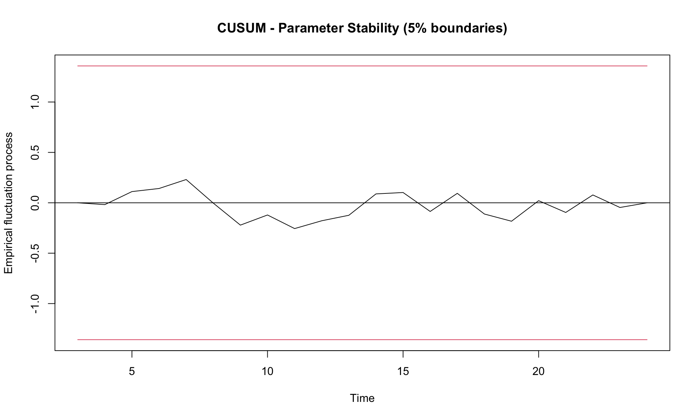
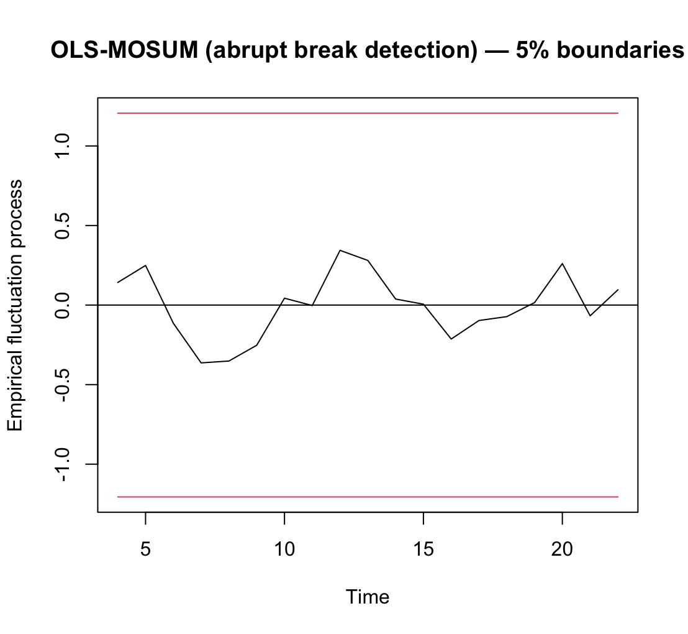

 # Methodology & Model Framework

## 1. Research Design & Econometric Strategy

This analysis adopts a country-specific time-series framework to evaluate the short-run dynamics of UAE FDI inflows.

A panel approach is deliberately avoided for two reasons:

1. The objective is to model UAE-specific investment behaviour rather than cross-country averages.  
2. Incorporating additional countries would introduce structural heterogeneity (external / different institutional quality, regulatory regimes, capital controls, and fiscal structures) that could obscure UAE-specific transmission mechanisms.

The dataset is annual and spans 2001–2024. Given the relatively small sample and mixed integration properties of macroeconomic variables, a flexible time-series model suited to limited observations is required.

Accordingly, the core empirical framework is an Autoregressive Distributed Lag (ARDL) model.

---

## 2. Data & Variable Construction

### Estimation Window
The final cleaned and refined dataset covers the period 2001–2024, selected to ensure complete and consistent coverage across all variables used in the analysis.

### Variables

| Variable | Description | Source | Rationale 
|----------|------------|-----------|-----------|
| FDI Net Inflows | Current USD | [BoP database World Bank - WDI](https://data.worldbank.org/indicator/BX.KLT.DINV.CD.WD?locations=AE) | Dependent variable capturing realised foreign direct investment activity |
| Brent Crude Oil Price | USD per barrel | [FRED](https://fred.stlouisfed.org/series/POILBREUSDA) | Proxy for regional liquidity and investor confidence |
| Real GDP Growth (UAE) | Annual % change | [IMF WEO](https://www.imf.org/external/datamapper/NGDP_RPCH@WEO/ARE?zoom=ARE&highlight=ARE) | Captures domestic economic momentum and market potential |
| Trade Openness | Trade as % of GDP | [World Bank](https://data.worldbank.org/indicator/NE.TRD.GNFS.ZS) | Measures integration with global markets and structural openness |

FDI inflows are measured in nominal USD. This is intentional, as Brent oil prices are also nominal; maintaining nominal consistency avoids introducing additional deflation assumptions.

FDI data were cross-validated against UNCTAD to ensure consistency.

### Transformations

To stabilize variance and reduce skewness, a natural logarithm transformation is applied to:
  - FDI inflows  
  - Brent oil prices  

GDP growth and trade openness are used in level form.

---

## 3. Stationarity & Integration Properties

Macroeconomic time-series often exhibit stochastic trends. Regressions involving non-stationary variables can produce spurious relationships and unreliable inference. Stationarity testing is therefore conducted to confirm the time-series properties of the data and guide model specification. Stationarity was assessed using:

- Augmented Dickey–Fuller (ADF) test  
- KPSS test  

Results indicate a mix of I(0) and I(1) variables.

### Stationarity Test Summary (5% Significance Level)

| Variable | ADF Level (drift, lag 1) | ADF Diff (drift, lag 1) | ADF 5% CV | KPSS Level (μ) | KPSS 5% CV | Integration Order |
|----------|--------------------------|--------------------------|-------|---------------|-------|-------------------|
| ln(FDI)  | -4.93 | -4.71 | -3.00 | 0.600 | 0.463 | I(1) |
| ln(Brent)| -2.85 | -4.00 | -3.00 | 0.330 | 0.463 | I(1) |
| Trade Openness | -1.42 | -5.26 | -3.00 | 0.864 | 0.463 | I(1) |
| GDP Growth | -3.10 | -5.03 | -3.00 | 0.177 | 0.463 | I(0) |

**Note:** CV denotes the 5% critical value.

ADF results indicate that ln(FDI), ln(Brent), and Trade openness are non-stationary in levels but stationary in first differences. GDP growth is stationary in levels. KPSS results broadly support these findings. Given this mixture, ARDL is appropriate because it:

- Accommodates I(0) and I(1) regressors  
- Does not require pre-differencing  
- Allows flexible lag structures  
- Performs well in small annual samples  

---

## 4. Model Specification & Lag Selection

Given the small sample size, lag selection in the ARDL model is critical to avoid over-fitting and preserve degrees of freedom. Lag length was determined using:

- Akaike Information Criterion (AIC)  
- Bayesian Information Criterion (BIC)  

Lag caps were restricted to (3,3,3,3) to prevent overfitting. Expanding lag caps resulted in unstable information criteria values, particularly with AIC trending toward extreme values — a known small-sample issue.

### Information Criteria Results

| Model (p, q1, q2, q3) | AIC | BIC |
|------------------------|------|------|
| ARDL(2,3,3,0) | **31.379** | 44.958 |
| ARDL(2,3,2,0) | 34.137 | **43.961** |

The AIC-selected model, ARDL(2,3,3,0), achieves the lowest AIC and is therefore adopted as the baseline specification. The BIC-selected alternative, ARDL(2,3,2,0), is more parsimonious but yields a marginally higher AIC.

Both criteria consistently select:

- 2 lags for FDI  
- 3 lags for Brent  
- 0 lags for GDP growth

### Final Adopted Specification

Based on the information criteria results, **ARDL(2,3,3,0)** is adopted as the final model specification.

This **ARDL(2,3,3,0)** captures:

- FDI persistence (lagged dependent variable)  
- Delayed oil effects  
- Short-run growth effects  
- Contemporaneous trade openness impact

---

## 5. Diagnostic Testing & Model Validity

Extensive diagnostic testing is conducted to ensure that coefficient inference is reliable and that model residuals satisfy core regression assumptions.

### 5.1 Serial Correlation

Breusch–Godfrey LM test detected serial correlation up to lag 2.

| Test Order | LM Statistic | df | p-value |
|------------|-------------|----|---------|
| AR(1)      | 4.1718      | 1  | 0.0411  |
| AR(2)      | 7.4918      | 2  | 0.0236  |

**Note:** df stands for degrees of freedom.

Since serial correlation affects standard errors (not coefficient estimates) and biases inferences, heteroskedasticity and autocorrelation consistent (HAC) Newey–West robust standard errors are applied for inference.

### 5.2 Heteroskedasticity

Breusch–Pagan and White-type tests indicate no evidence of heteroskedasticity.

| Test | Statistic | df | p-value |
|------|----------|----|---------|
| Breusch–Pagan | 11.52 | 11 | 0.4008 |
| White (auxiliary LM) | — | 2 | 0.2362 |

Residual variance appears homoskedastic.

### 5.3 Normality

Jarque–Bera test suggests residuals are approximately normally distributed.

- JB statistic: 1.4925   
- p-value: 0.4741  

### 5.4 Residual Stationarity

An Augmented Dickey–Fuller (ADF) test was performed on model residuals.

- Test statistic (τ): −3.474  
- 5% critical value: −3.00  
- p-value (approx.): 0.003

The null hypothesis of a unit root is rejected. Residuals are I(0), supporting stability of the short-run specification.

### 5.5 Stability Tests & Plots

#### CUSUM Test

- Test statistic: 0.2558  
- p-value: 1.000

 

#### OLS–MOSUM Test

- Test statistic: 0.3634  
- p-value: 0.7083  



Both tests remain within 5% boundaries throughout the sample period.

No evidence of structural breaks, parameter instability, or abrupt regime shifts is detected. This supports use of the model for short-term projections.

### Diagnostic Conclusion

- Serial correlation present → HAC corrections applied  
- No heteroskedasticity  
- Residuals approximately normal  
- Residuals stationary  
- Parameters stable  

The ARDL(2,3,3,0) model is statistically well-behaved and suitable for short-run inference and forecasting under robust standard errors.

---

## 6. Bounds Test & Long-Run Considerations

A bounds F-test (Wald Test) was conducted to assess cointegration.

- F-statistic: 2.6252  
- p-value: 0.3211  

The null hypothesis of no cointegration cannot be rejected.
Results do not indicate evidence of long-run equilibrium relationships.

Accordingly:

- No error correction term (ECM) is estimated  
- The model is explicitly treated as a short-run dynamic framework  

This is consistent with the small annual sample and the focus on short-term forecasting.

---

## 7. Fitted ARDL & Coefficient Interpretation

The ARDL(2,3,3,0) model was estimated using HAC (Newey–West) robust standard errors. Coefficient estimates are reported below.

### 7.1 Short-Run Coefficient Estimates

| Variable | Estimate | Robust t-stat | p-value | Significance |
|-----------|----------|---------------|---------|--------------|
| L1 ln(FDI) | 0.5057 | 2.53 | 0.0322 | * |
| L2 ln(FDI) | -0.0977 | -0.91 | 0.3852 |   |
| ln(Brent) | 0.4898 | 1.81 | 0.1035 |   |
| L1 ln(Brent) | -1.4648 | -2.82 | 0.0200 | * |
| L2 ln(Brent) | 1.5879 | 2.42 | 0.0387 | * |
| L3 ln(Brent) | -1.4484 | -3.39 | 0.0080 | ** |
| Trade Openness | 0.0006 | 0.03 | 0.9758 |   |
| L1 Trade Openness | -0.0149 | -0.85 | 0.4160 |   |
| L2 Trade Openness | 0.0180 | 0.95 | 0.3653 |   |
| L3 Trade Openness | 0.0147 | 1.07 | 0.3127 |   |
| GDP Growth | 0.0453 | 1.76 | 0.1130 |   |

(*Significance levels:* "*" p < 0.05, "**" p < 0.01, " " p < 1)

*Note:* L1, L2, and L3 denote first, second, and third lags of the respective variable (e.g., L1 ln(FDI) refers to ln(FDI)_{t−1}).


### 7.2 Interpretation of Key Dynamics

**FDI Persistence**

The coefficient on L1 ln(FDI) is positive (0.51) and statistically significant, indicating strong short-run persistence in FDI inflows. Approximately 50% of the previous year’s inflow persists into the current period.

The second lag (L2) is negative but statistically insignificant, suggesting diminishing multi-year effects.


**Oil Price Transmission**

Oil prices exhibit alternating and statistically significant lag effects:

- The first lag (L1) is negative and significant.
- The second lag (L2) is positive and significant.
- The third lag (L3) is negative and significant.

This pattern suggests staged adjustment dynamics rather than a monotonic response. Short-run oil shocks appear to generate initial caution, followed by liquidity-driven rebound effects, before normalization.

The contemporaneous ln(Brent) coefficient is positive but not statistically significant at conventional levels.


**Domestic Growth**

GDP growth enters positively (0.045) but is not statistically significant at the 5% level. This suggests macroeconomic momentum supports FDI, but its short-run impact is weaker relative to FDI persistence and oil-driven liquidity channels.


**Trade Openness**

Trade openness and its lags are statistically insignificant in the short-run specification. This suggests that openness may operate as a structural or long-term determinant of FDI rather than a cyclical short-run driver.


### 7.3 Summary of Short-Run Drivers

The dominant short-run drivers of UAE FDI inflows are:

- FDI persistence effect
- Lagged oil price dynamics

GDP growth plays a secondary role, while trade openness does not materially influence short-term fluctuations within the estimation window.

---

## 8. Forecast Construction Framework

### 8.1 ARDL Forecasting Structure

The ARDL(2,3,3,0) specification is estimated over 2001–2024. Forecasts for 2025–2026 are generated using a recursive approach.

Because the model contains lagged dependent variables, forecasts are constructed sequentially:

1. The 2025 forecast uses:
   - Observed 2024 values
   - Assumed 2025 exogenous inputs (i.e. exogenous paths)

2. The 2026 forecast uses:
   - The predicted 2025 FDI value (recursive substitution)
   - Assumed 2026 exogenous inputs

This ensures internal consistency with the ARDL specification - which can formally be written as:

```
ln(FDI)_t = α + β₁ ln(FDI)_{t−1} + β₂ ln(FDI)_{t−2} + γ₀ ln(Brent)_t + γ₁ ln(Brent)_{t−1} + γ₂ ln(Brent)_{t−2} + γ₃ ln(Brent)_{t−3} + δ₀ Trade Openness_t + δ₁ Trade Openness_{t−1} + δ₂ Trade Openness_{t−2} + δ₃ Trade Openness_{t−3} + θ GDP Growth_t + ε_t  
```

### 8.2 Exogenous Path Assumptions

ARDL forecasts require future values of explanatory variables. As these values are not observed beyond 2024, explicit exogenous projections are imposed for 2025–2026. 3 macroeconomic scenarios are constructed: **Base**, **Downside**, and **Upside**. The underlying ARDL structure remains fixed; only exogenous inputs vary across scenarios.

#### Base Case – Gradual Normalization

- **Brent:** USD 78.19 in 2025, moderating to USD 72 in 2026  
- **GDP Growth:** 4.8% in 2025, 5.0% in 2026  
- **Trade Openness:** 203.7% in 2025, 205.0% in 2026  

This scenario reflects continued macroeconomic stability with moderate easing in energy prices.

#### Downside Case – Prolonged External Tightness

- **Brent:** USD 65 in 2025, USD 62 in 2026  
- **GDP Growth:** 3.5% in 2025, 4.0% in 2026  
- **Trade Openness:** Same path as base case  

This scenario captures weaker global liquidity conditions and softer energy markets.

#### Upside Case – Liquidity & Confidence Rebound

- **Brent:** USD 88 in 2025, USD 90 in 2026  
- **GDP Growth:** 5.5% in 2025, 5.8% in 2026  
- **Trade Openness:** Same path as base case  

This scenario reflects stronger-than-expected global conditions and improved investor confidence.

Forecasts generated under these assumptions are conditional projections. Differences across scenarios arise solely from variations in exogenous inputs rather than changes in the underlying econometric structure.


---

### 8.3 Interpretation of ARDL Forecasts

Pure ARDL forecasts reflect:

- Short-run oil sensitivity  
- Lagged FDI persistence  
- Immediate macroeconomic effects  

However, in small samples with oil-sensitive regressors, ARDL forecasts may overreact to short-term fluctuations. 

For this reason, a structural anchor is introduced for the base case only (Section 9).

---

## 9. Trend Anchor Construction (Base Case Only)

ARDL models can amplify short-run volatility in small samples, particularly with oil-sensitive regressors.

To address this, a structural anchor is introduced for the base case only.

The anchor is constructed as a weighted geometric average of recent log FDI growth, with greater weight assigned to post-COVID years (2023–2024), reflecting the structural shift in UAE FDI momentum.

Let:

FDI_anchor_growth = Σ (w_i × g_i)

Where w_i are weights applied to recent annual log growth rates.

The anchor:

- Captures structural momentum  
- Reduces short-run oil overreaction  
- Reflects observed post-pandemic investment acceleration  

---

## 10. Blended Forecast Specification (Base Case Only)

Final base forecast:

FDI_final = w × FDI_ARDL + (1 − w) × FDI_anchor  

Where:

w = 0.6  

Downside and Upside scenarios remain purely model-driven to preserve stress-test integrity.

---

## 11. Limitations

- Annual data restricts degrees of freedom.  
- Small sample limits structural break detection power.  
- Oil price proxy may indirectly capture broader liquidity effects.  
- Forecasts are conditional on assumed exogenous paths.  
- No formal out-of-sample validation due to short horizon.  

Where available, in-sample metrics (RMSE, Adjusted R²) are reported in the output section.
